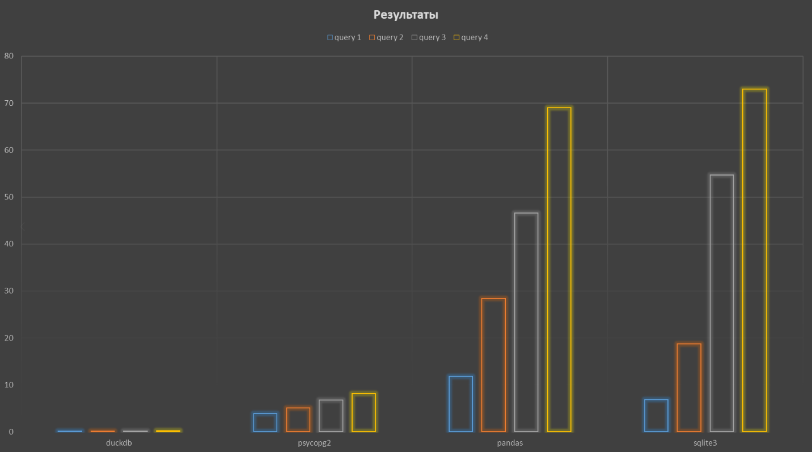

# Лабораторная работа 3
Создание бенчмарка для четырех (в моем случае) библиотек, реализующих разный подход к работе с базами данных

## Содержание
- [Библиотеки](#Библиотеки)
- [Информация](#Информация)
- [Результаты](#Результаты)
- [Выводы](#выводы)

## Библиотеки
Для баз данных:
- pandas
- psycopg2
- duckdb
- sqlite3
- sqlalchemy (как вспомогательная для pandas)
  
Прочие:
- timeit
- statistics
- csv

## Информация
Бенчмарк представляет собой измерение медианного времени выполнения четрыех запросов в файле размером 2гб.

## Результаты
duckdb big_file

query 1: 0.013206799999991858 seconds

query 2: 0.04577540000001079 seconds

query 3: 0.193118350000006 seconds

query 4: 0.2626727500000072 seconds

psycopg big_file

query 1: 3.9478596499993728 seconds

query 2: 5.124616600000081 seconds

query 3: 6.785811799999465 seconds

query 4: 8.16188339999917 seconds

pandas big_file

query 1: 11.85048095000002 seconds

query 2: 28.45529674999989 seconds

query 3: 46.595731000000114 seconds

query 4: 69.03818505000027 seconds

sqlite big_file

query 1: 6.846615200000997 seconds

query 2: 18.714157700000214 seconds

query 3: 54.67122595000001 seconds

query 4: 72.99690785000075 seconds

## Выводы
- `DuckDB` работает быстрее всех, так как разрабатывалась специально для работы с большим количеством данных
- `SQLite3` проста, но разработана для работы с малым количеством данных, поэтому в данных условиях показала себя хуже остальных в большинстве тестов
- `Psycopg2` выполняет sql-запросы быстро благодаря эффективной реализации протокола обмена данными с базой данных PostgreSQL(+ PostgreSQL достаточен эффективен на больших объемах данных из-за продвинутой оптимизации запросов), однако время зависит также от задержки при обращении к базе данных
- `Pandas` работает медленно, потому что хранит весь набор данных в памяти и не оптимизирован для обработки данных

